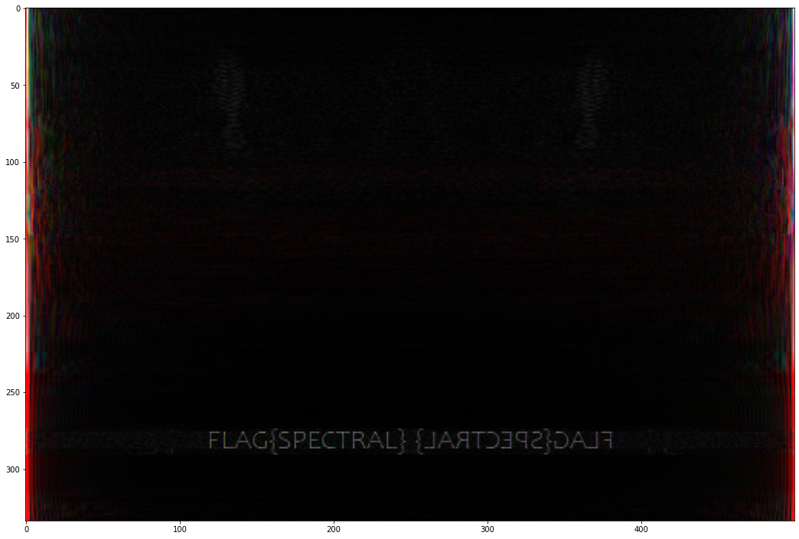

# secret.sloth

Minimal code example for that CTF task that drove you insane


1. Use Google lens or tineye to find the [original unmodified image](https://www.reddit.com/r/Slothswithhats/comments/1cpj4v/he_killed_a_man_for_that_hat/)
2: Use this code

```
orig=Im.open('secret-sloth.png')
sloth = np.asarray(sloth)[:,:,:3].astype(int)

orig=Im.open('iHCQX6p.png')         # original sloth image found on reddit
orig = np.asarray(orig).astype(int)

# compute FFT for the original sloth image, and the one with the secret message
origfft=np.fft.fft2(orig)
slothfft=np.fft.fft2(sloth)

out = abs(np.fft.fft2(slothfft-origfft))
out = abs(slothfft-origfft)

# normalize
out=(out+out.min())
out/=out.max()

ax.imshow(10*out)
```


